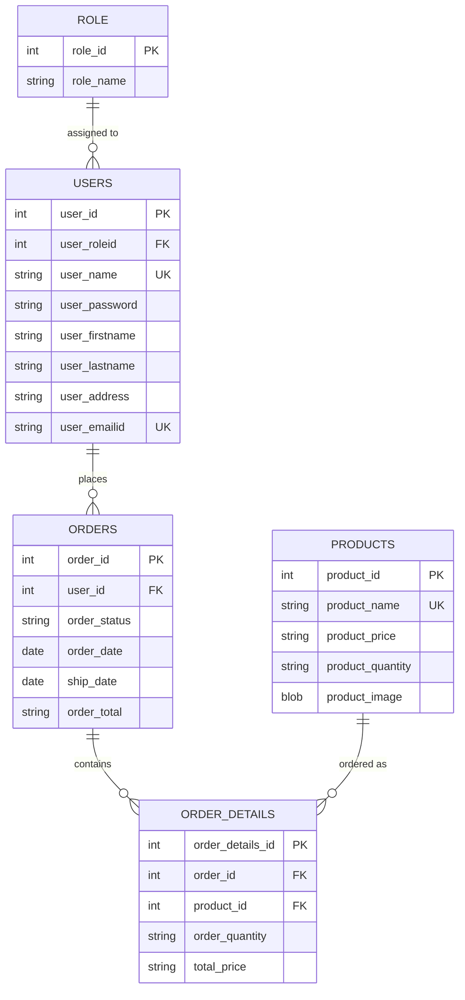

# 🎨 ClipCart — Sticker Shop Order & Inventory Manager

> A full-stack Spring Boot web app for running a small clip-art/sticker
> business: customers browse and order stickers, admins manage inventory,
> users, and order fulfillment.

[](https://www.oracle.com/java/)
[](https://spring.io/projects/spring-boot)
[](https://maven.apache.org/)
[](LICENSE)

---

## ✨ Overview

ClipCart is a JSP + Spring MVC application that models a real small-business
storefront: a catalog of sticker/clip-art products, a shopping flow with
order history, role-based access (`admin` vs `customer`), and an admin
back office for managing inventory and user accounts.

It was originally built as an academic project (`proj4`) and is being
cleaned up here into a presentable portfolio piece.

## 🚀 Features

- **Authentication** — registration and login, session-based auth via `HttpServletRequest`.
- **Role-based views** — `admin` and `customer` roles unlock different pages/actions.
- **Shop / Catalog** — browse products with images, price, and stock quantity.
- **Ordering** — add items to an order, view running totals, submit an order.
- **Order history** — customers see their past orders; admins can update order status (e.g. `pending → shipped`).
- **Inventory management (admin)** — create/update/delete products, adjust stock and price.
- **User administration (admin)** — edit user profiles and role assignments.
- **Product images** — stored and served as Base64-encoded blobs.

## 🧱 Tech Stack

| Layer          | Technology                                   |
|----------------|-----------------------------------------------|
| Language        | Java 8+                                       |
| Framework      | Spring Boot 2.2.4 (Spring MVC)                |
| Views          | JSP + JSTL (`/WEB-INF/views`)                 |
| Data access    | Spring JDBC (`JdbcTemplate`), hand-written DAO layer |
| Database       | PostgreSQL (see `casdbscript.txt`)            |
| Build          | Maven                                         |

**Architecture:** classic layered MVC —
`Controller → Service → DAO(Impl) → Database`, with plain DTOs (`User`,
`Product`, `Order`, `OrderDetails`, `Role`) shuttled between layers and JSPs.

```
edu.cas
 ├─ controller/   CasController        (all @RequestMapping endpoints)
 ├─ services/     CasService            (interface)
 ├─ serviceimpl/  CasServiceImpl
 ├─ dao/          CasDao                (interface)
 ├─ daoimpl/      CasDaoImpl            (JdbcTemplate queries)
 └─ dto/          User, Product, Order, OrderDetails, Role
```

## 🗺️ Data Model

The database has five core tables. Customers place **orders**, each order
is broken into **order_details** line items that reference a **product**;
every user has a **role** (`admin`/`customer`).



## 🏁 Getting Started

### Prerequisites
- JDK 8+
- Maven 3.6+
- PostgreSQL (or adapt the driver/scripts to your DB of choice)

### 1. Clone & configure the database
```bash
git clone https://github.com/<your-username>/clipcart.git
cd clipcart/clipartstickers

# Create the schema (adjust connection settings to your environment)
psql -U <user> -d <database> -f ../casdbscript.txt
psql -U <user> -d <database> -f ../casproductimagescript.txt
psql -U <user> -d <database> -f ../cassprivilegescript.txt
psql -U <user> -d <database> -f ../casstoredprocedurescript.txt
```

### 2. Configure the app
Update `src/main/resources/application.properties` with your database URL,
username, and password.

### 3. Run it
```bash
./mvnw spring-boot:run
# or
mvn clean package
java -jar target/clipartstickers-1.0.jar
```

The app starts on `http://localhost:8080/` by default.

## 📄 Pages / Endpoints

| Path                       | Purpose                                   |
|-----------------------------|--------------------------------------------|
| `/`                         | Landing / welcome page                     |
| `/register`, `/login`       | Sign up / sign in                          |
| `/home`                     | Post-login landing (role-aware)            |
| `/profile`                  | View/edit own profile                      |
| `/shop`                     | Browse products, add to order              |
| `/orderhistory`             | View orders; admins can update status      |
| `/productinventory`         | Admin: manage product catalog              |
| `/useradministration`       | Admin: manage users and roles              |

## 🛠️ Roadmap / Ideas for Improvement

These are natural next steps to keep leveling this project up:

- [ ] Hash passwords (BCrypt) instead of storing them in plain text
- [ ] Replace JSP/JSTL with Thymeleaf (or a separate React/Vue front end + REST API)
- [ ] Add Spring Security for auth/roles instead of manual session checks
- [ ] Add input validation (`@Valid`/Bean Validation) on all forms
- [ ] Add unit/integration tests (JUnit + Mockito, or `@SpringBootTest`)
- [ ] Containerize with Docker + `docker-compose` (app + Postgres)
- [ ] Add CI (GitHub Actions) running `mvn verify` on every push
- [ ] Store images as files/URLs rather than inline Base64 blobs

## 📜 License

Choose a license (MIT is a sane default for a portfolio project) and add
it as `LICENSE` in the repo root — this README already references it.
